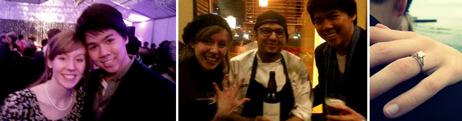

##About the Couple
I met Weien on the third floor of the Larrance Academic Center at North Central College in September of 2010. He brought snacks to class every morning – from yummy candy from China to corn on the cob that he carried around in his coat pocket, to a peanut butter sandwich (the smell of which made me feel nauseous and sparked one of our very first conversations… lucky me!)

In March of 2011, we were both selected to present at a research conference in Ithaca, New York, where we enjoyed waffles at [Waffle Frolic](http://www.wafflefrolicking.com/), and [slid down banisters](https://sphotos-b.xx.fbcdn.net/hphotos-ash4/250512_692685143204_7608251_n.jpg). Weien’s enthusiastic prodding at dinner one night got me to try mushrooms for the first time, and after a little less prodding, I got Weien to go on a sort-of-date with a girl we met there – a date I secretly followed him on, insisting to myself that it was just for fun, of course.

We became good friends at Ithaca, and continued our friendship when we returned to Illinois. We played music together between classes, Weien introduced me to his favorite sushi place, his favorite Mediterranean place, and a greasy little gyro place that we love, but anyone Greek would probably hate.

We started dating in May of 2011 and have been on many adventures since. We love to go dancing, try new restaurants, sing together, and spend time with the fam.

  *~Gracie*
  
##About the Engagement

You can listen to an podcast-style audio retelling of the proposal [here](engagementstory.mp3) (~9min):

Also, you can still find our Save the Date video [here](http://vimeo.com/49057034)!

