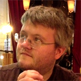

##Gretta (Maid of Honor, Sister of the Bride)

Gretta is just about the most compassionate person I’ve ever met. 
She cares about everything (including things that are inanimate or 
things she doesn’t believe exist). I am convinced this is why she 
still loves me after all these years – her ignoring me would break 
my heart, and she couldn’t take that.
 
Gretta and I share countless memories, inside jokes, and secret 
glances, and to me, that’s irreplaceable. (Gah-rah-tah, jahtah 
dahlahn, ah ahm sah hahnahed tah hahv yah ahs mah mahd ahv ahnah. 
Ah lahv yah!!)

&nbsp;

##Victoria (Bridesmaid, Sister of the Groom)

Victoria is absolutely BRIMMING with ideas. I have 40 emails (and 
counting) from her, specific to the wedding. In fact, this very 
website you are reading was designed and created by none other 
than Victoria herself! As I’ve gotten to know Victoria over the 
past couple years, I’ve come to realize that she’s a free spirit, 
a refreshingly opinionated thinker, a talented artist, and a gifted 
conversationalist. I’m excited and blessed to have her in my 
wedding and to, very soon, have her as a sister.

&nbsp;

##Amber (Bridesmaid, Sister of the Bride)

Amber is fun loving and family-oriented. I can always count on a 
phone call from her just to check in on me. Amber always has 
something exciting up her sleeve. Recently, she’s volunteered 
for a [dog rescue](http://www.annieslittleangels.org/) and 
fosters puppies. Even MORE recently, she’s 
been carrying my first niece or nephew around for months and 
months! By the time the wedding rolls around, that little 
stinker will be born! I could not be more excited.
 

&nbsp;

##Sonia (Bridesmaid, Sister of the Bride)

Sonia is hardworking and sweet. I’ve known her since 1997 and 
we went to school together. I particularly remember the day in 
7th grade when she accidently wore her dad’s sweatpants to gym. 
Drowning in fabric in the girl’s bathroom, she confessed to me 
her love for my brother – and years later, they were married. 
She is always busy – whether it’s going running with friends, 
making a monkey cake for Gretta’s birthday, taking care of my 
brother Johnnycakes, or (more recently) working as a real live 
REGISTERED NURSE! Even though Sonia’s schedule is booked, she 
always makes time to visit and catch up.
 

&nbsp;

##Maggie (Bridesmaid, Friend of the Bride)

Maggie is a constant in my life. I met her when I was 8 and we 
were inseparable for years after that. Her house was my second 
home, especially during my childhood summers. We ran away together, 
started a band together (but spent all the time taking band 
pictures and not composing any songs whatsoever), survived 
high school together, the whole shebang.
 
Also, fun fact: Maggie is the only person to have ever made me laugh 
so hard I threw up. It was the best throwing up experience of my life.
 

&nbsp;

##Susie (Bridesmaid, Friend of the Bride)

Susie is an old soul. I am four years her senior, but I’ve never felt 
any age difference because she has always been able to understand what 
I was going through before she had to go through it herself. I’m 
really excited to have her in the wedding party because she is a hoot 
and a half to be around. In fact, Susie is wittier and funnier than 
Elaine from Seinfeld (got that, Sue?)

&nbsp;

##Micah (Best Man, Friend of the Groom)

Micah is my best friend (other than Jesus and Gracie and family) and has been for around a decade, now. Over the years and the loads of emails, he has been my songwriting partner, my iron-sharpening iron, and my accountability partner. He's a straight shooter, a penpal extraordinaire, and someone whose God-centeredness I've always admired. Micah has stayed my friend even when I've neglected our friendship. 

He once described a 15-year old Weien as "a lovesick boy who loved music" as well as "a tangled mess of yarn." He was and remains right on both counts.

&nbsp;

##Wolf (Groomsman, Friend of the Groom)

Wolf (short for his middle name, Wolfgang von) is my career mentor. He has been patiently guiding me through my software development studies for several months now, even though it's taking a long time, even though he sometimes has to tell me things twice. He not only teaches me but liberally invites me to stay over at his apartment, always offers to take care of dinner, and even keeps ice cream sandwiches in the freezer just because he knows they bring me cheer.

And he even takes really good care of my sister! Simply put, he's a really giving person.

&nbsp;

##Andrew (Groomsman, Friend of the Groom)

Andrew is my college pastor and spiritual mentor. As a sophomore at North Central, I met Andrew one Wednesday night and subjected him to a not-very-concise treatment on my relationship woes. Since then, he has pushed me toward leadership opportunities, kept an eye on me as my faith has climbed and fallen, and gently rebuked me when I needed it most. He reminds me that he can actually see progress in my spiritual battles, which I always find incredibly encouraging. His lessons have helped me think about the Bible in relation to the world today, and I'm a better Christian for his investment in me.

&nbsp;

##Hudson (Groomsman, Brother of the Bride)

Hudson is The Party. He is the family's much-needed holler, a blast of spontaneity, a man who is game for any adventure. If we didn't have Hudson, Gracie would probably still be a long way from being able to tolerate my obtuse dancing and random songifying. They say I am most like him in most respects, but I can only hope to be as much fun, as intellectually sharp, as good with people, and as professionally ambitious. He loves his family so much, and I'm glad I get to be a part of it, soon.

&nbsp;

##Hadyn (Groomsman, Brother of the Bride)

Hadyn is probably a breakthrough prescription drug in some universe, because he brings so much calm and happy relaxation with him when he walks in the room. Maybe it's because he stands so effortlessly by his beliefs. Maybe because he draws peace from his love of deep ideas and fine art. Or maybe it's because he's not afraid to laugh at silly things, like flatulence and funny faces. His zen is contagious, and I'm glad for it--I can always use a double dose of his easygoing, boyish earnestness.

&nbsp;

##Nate (Groomsman, Brother of the Bride)

Nate is the one who was the most conservative about giving me his stamp of approval. He waited to learn about my strengths and weaknesses, tried to get a feel for my spiritual state, and conscientiously observed how I interacted with Gracie before I finally got the nod. Nate is the one who notices the little things, who keeps himself under the microscope, who keeps tabs on how people are feeling. I know that by joining the family I step into his sphere of affectionate watchfulness, and that's definitely a fortunate place to be.
